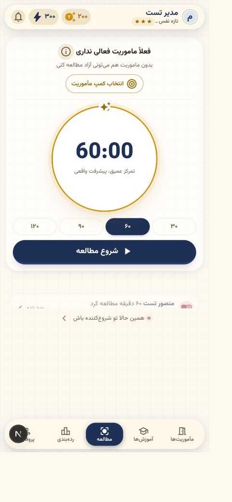
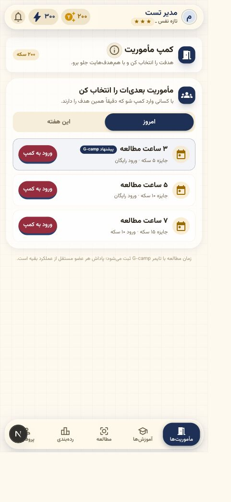
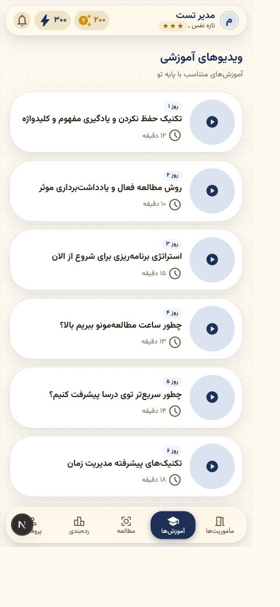
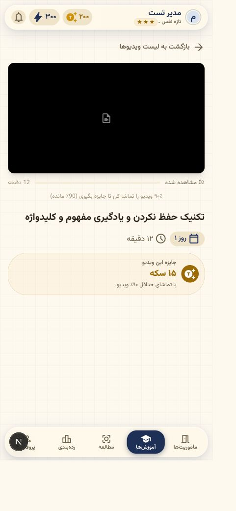
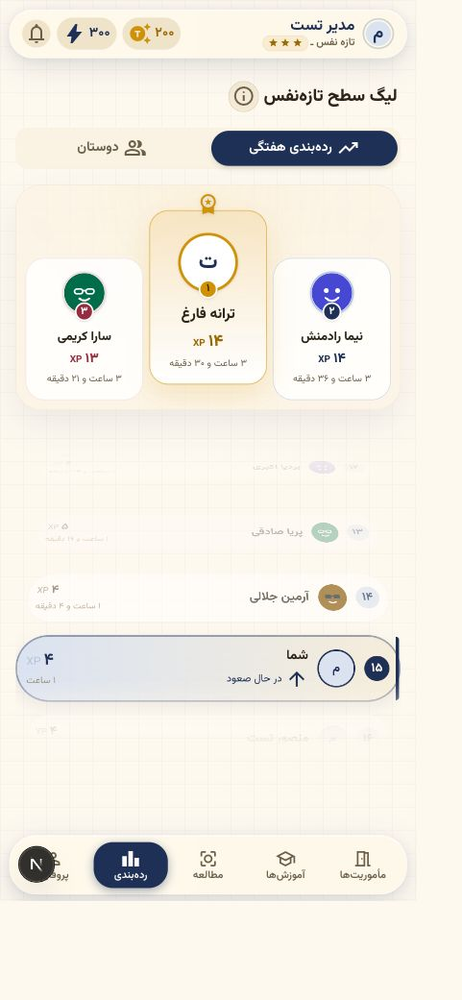
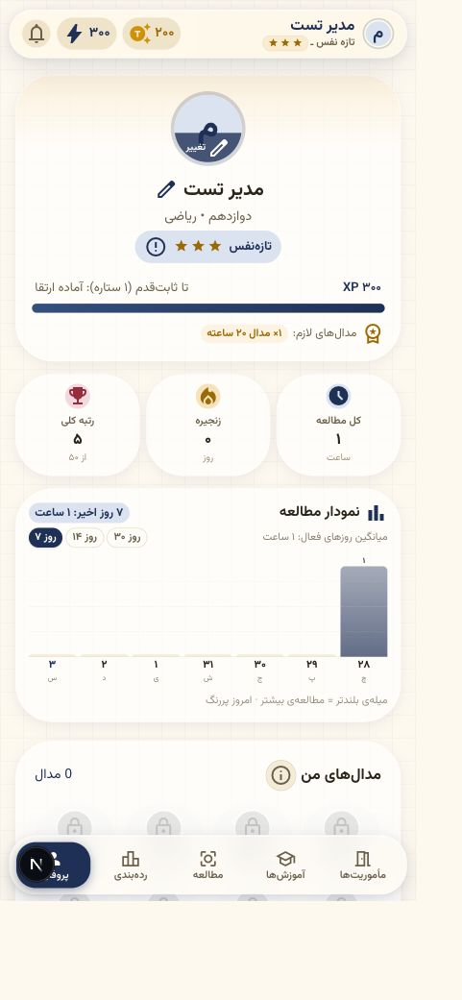
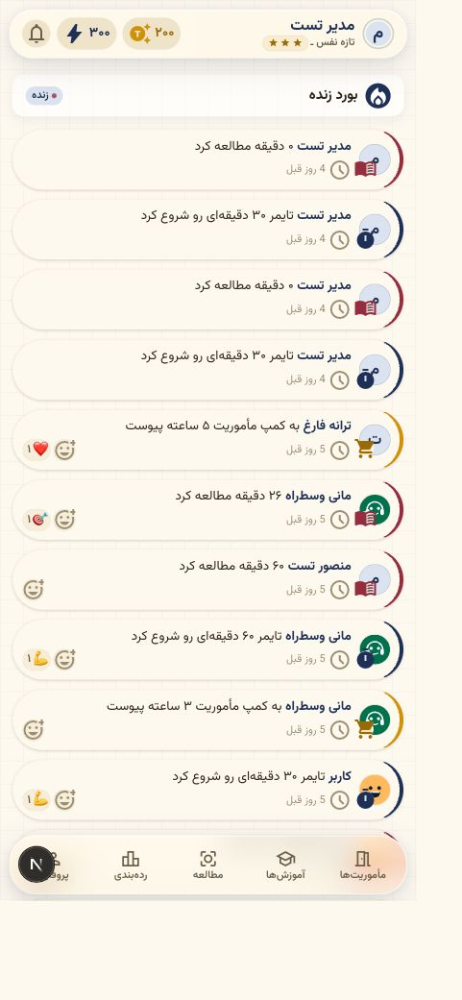
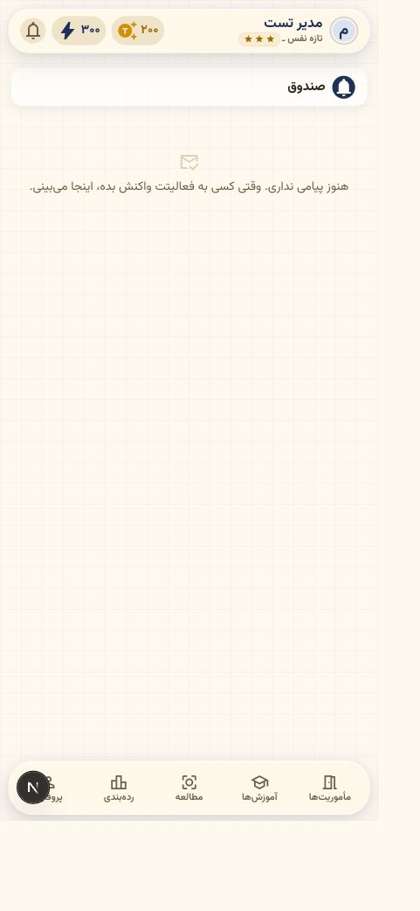

# ممیزی جامع محصول و فنی G-camp

تاریخ: ۳ شهریور ۱۴۰۵ / 2026-08-25
دامنه: تجربه کاربری موبایل، حلقه مطالعه و پاداش، صحت داده، مقیاس ۵۰۰ کاربر هم‌زمان، تحلیل رفتار، ثبت خطا، امنیت و عملیات

## جمع‌بندی مدیریتی

G-camp از نظر هویت بصری، فارسی/RTL، تمرکز روی تایمر و وضوح ارزش اصلی محصول پایه خوبی دارد؛ اما در وضعیت فعلی برای رشد به ۵۰۰ کاربر هم‌زمان «آماده و قابل اتکا» محسوب نمی‌شود. تست محلیِ production نشان داد ۵۰۰ درخواست خواندنی هم‌زمان و ۵۰۰ اتصال SSE بدون خطای HTTP پاسخ می‌گیرند، ولی p95 داشبورد به ۲٫۷ ثانیه رسید و این آزمون روی دیتابیس فقط ۵۰ کاربر و سخت‌افزار محلی انجام شد. مهم‌تر از سرعت، چند race condition در پرداخت XP/سکه، پایان تایمر، مأموریت، ویدیو و تورنمنت وجود دارد که تحت هم‌زمانی می‌تواند پاداش تکراری، کسر سکه دوباره یا داده متناقض بسازد.

ارزیابی کیفی:

- تجربه بصری و ساختار اطلاعات: خوب، با چند مانع خوانایی و اعتماد.
- قابلیت اطمینان حلقه اصلی مطالعه: پرریسک تا رفع خطاهای P0.
- آمادگی مقیاس ۵۰۰ کاربر: اثبات‌نشده؛ برای بار خواندنی کوتاه قابل تحمل، برای بار واقعی و write-heavy ناامن.
- ثبت رفتار کاربر: جزئی و ناکافی برای مدیریت محصول.
- ثبت خطا: Sentry پایه خوبی دارد، اما خطاهای caught، خطاهای کسب‌وکاری و شکست ارسال‌ها عمدتاً ماندگار و قابل جست‌وجو نیستند.

## نتیجه تست بار

| سناریو | نتیجه | p50 | p95 | بیشینه |
|---|---:|---:|---:|---:|
| ۱۰۰ GET احراز‌شده ترکیبی، concurrency=25 | ۱۰۰٪ پاسخ 200، ۱۵۶٫۹ req/s | ۱۴۷ms | ۳۴۹ms | ۴۲۸ms |
| ۵۰۰ SSR هم‌زمان داشبورد | ۵۰۰/۵۰۰ پاسخ 200، ۱۲۳٫۷ req/s | ۱٫۷۴s | ۲٫۷۰s | ۴٫۰۳s |
| ۵۰۰ اتصال SSE برای ۵ ثانیه | ۵۰۰/۵۰۰ متصل | — | — | اتصال همه در ۲۸۷ms |

این نتیجه ظرفیت production را تضمین نمی‌کند: دیتابیس محلی فقط ۵۰ کاربر داشت، درخواست‌های write-heavy عمداً اجرا نشدند، و منابع VPS/CDN شبیه‌سازی نشد. خروجی خام در `load-results.json` و اسکریپت تکرارپذیر در `load-test.mjs` است.

## ایرادات P0 — قبل از رشد باید رفع شوند

1. **پایان هم‌زمان یک جلسه می‌تواند دوبار پاداش بدهد.** endpoint ابتدا `endTime` را می‌خواند و بعد با `update` غیرشرطی جلسه و موجودی را تغییر می‌دهد. دو درخواست موازی هر دو می‌توانند از check عبور کنند. قفل یا `updateMany` مشروط به `endTime:null` و پرداخت در یک transaction لازم است. مرجع: `app/api/study/end/route.ts:22-87`.

2. **race بین tick و end و شکاف transaction در tick.** `tickCount` و افزایش XP/سکه در دو عملیات جدا انجام می‌شوند؛ crash بین آن‌ها پاداش را گم می‌کند و هم‌زمانی با end می‌تواند پرداخت را ناهماهنگ کند. مرجع: `app/api/study/tick/route.ts:34-44`.

3. **دو start هم‌زمان می‌تواند دو جلسه باز بسازد.** بستن sessionهای قبلی و ایجاد session جدید، بدون constraint دیتابیسی «فقط یک جلسه باز برای هر کاربر» است. migration دارای partial unique index نیست.

4. **تایمر در شکست شبکه خودش را با سرور آشتی نمی‌دهد.** `endSession` نبود response، status غیرموفق و retry را مدیریت نمی‌کند؛ UI می‌تواند جلسه را تمام‌شده نشان دهد ولی session روی سرور باز بماند. pause/resume نیز optimistic است و rollback ندارد. restore فقط به localStorage اعتماد می‌کند. مرجع: `components/dashboard/StudyTimer.tsx:246-258` و `:326-345` و `:419` به بعد.

5. **تکمیل مأموریت واقعاً idempotent نیست.** دو اجرای cron/end می‌توانند یک مأموریت active را هم‌زمان completed کنند و پاداش یا مدال را دوباره بدهند. مرجع: `lib/mission.ts:80-149`.

6. **پیشرفت ویدیویی قابل جعل و پاداش آن قابل دوباره‌پرداخت است.** API مستقیماً `watchedSeconds/totalSeconds` ارسالی کلاینت را می‌پذیرد و `rewardGiven` را شرط اتمیک نمی‌کند. مرجع: `app/api/videos/[id]/progress/route.ts:17-18` و `:44-57`.

7. **پلیر ویدیو می‌تواند به‌جای هر ۱۰ ثانیه چند درخواست در ثانیه بفرستد.** effect به `maxSeek` وابسته است، با هر timeupdate دوباره نصب می‌شود و `lastSave` صفر می‌شود. cleanup مربوط به HLS نیز از Promise بیرون نمی‌آید و اجرا نمی‌شود. مرجع: `components/videos/VideoPlayerClient.tsx:21-43` و `:45-86`.

8. **پرداخت‌های مأموریت/ویدیو/پروفایل/freeze/tournament به constraint اتمیک کافی متکی نیستند.** الگوی «balance را بخوان، بعد decrement کن» در درخواست موازی می‌تواند دوبار کسر یا balance منفی تولید کند. مسیرهای نمونه: `app/api/videos/[id]/buy/route.ts:48`، `app/api/profile/[id]/unlock/route.ts:41` و `app/api/streak/freeze/route.ts:41`.

9. **تسویه تورنمنت در اجرای موازی دوبار انجام‌پذیر است.** `rewardsPaid:false` خوانده می‌شود، جایزه پرداخت می‌شود و در پایان flag تغییر می‌کند. قفل job/claim اتمیک لازم است. مرجع: `lib/tournament.ts:92-121`.

10. **تعریف onboarding بین محصول، کد و پنل ادمین متناقض است.** منطق فعال onboarding را یک‌روزه کرده (`DEFAULT_ONBOARDING_DAYS=1`) اما funnel ادمین week2 را `>=6`، لید داغ را `>=3` و segment اعلان را `<6` می‌داند. در نتیجه آمار و تارگت‌گذاری فعلی برای cohort جدید غلط است. مراجع: `lib/onboarding.ts:20`، `app/(admin)/admin/page.tsx:19`، `app/(admin)/admin/leads/page.tsx:15` و `lib/notification-rules.ts:131`.

## ایرادات P1 — شرط عملیاتی برای ۵۰۰ کاربر واقعی

11. **SSE فقط داخل حافظه یک process است.** در scale افقی، event فقط به کاربران متصل به همان instance می‌رسد. Redis Pub/Sub/Streams یا سرویس realtime مشترک لازم است. مرجع: `lib/feed-broadcast.ts` و `app/api/feed/stream/route.ts`.

12. **هر اتصال SSE interval heartbeat مستقل دارد** و reconnect هیچ `event id` یا replay ندارد؛ event زمان قطع اتصال گم می‌شود. ۵۰۰ اتصال روی یک process در تست محلی برقرار شد، ولی تحمل reconnect storm بررسی نشده است.

13. **معماری production تک‌نمونه و single point of failure است.** compose برای app replica/load balancer ندارد؛ healthcheck فقط برای PostgreSQL و Redis دیده می‌شود و app healthcheck ندارد. rollback/versioning ایمیج و برنامه backup/restore عملیاتی روشن نیست.

14. **pool دیتابیس پیش‌فرض ۱۰ است** و درخواست‌های dynamic چند query اجرا می‌کنند. `getSession` و layout بخشی از user data را تکراری می‌خوانند. در burst ۵۰۰ داشبورد، latency p95 محلی ۲٫۷ ثانیه شد. مرجع: `lib/db.ts:9`.

15. **کارهای cron و اعلان صف جدا ندارند.** notification engine، mission processing و rank-drop کاربرها را با queryها و ارسال‌های متوالی پردازش می‌کنند و با requestهای کاربر روی همان app/pool رقابت دارند. distributed lock و job queue لازم است.

16. **leaderboard و برخی queryها با رشد داده unbounded می‌شوند.** ابتدا همه idهای هم‌سطح و سپس رکوردهای pool خوانده می‌شوند؛ برای ۵۰۰ کاربر فعلی قابل تحمل است اما الگوی مناسبی برای رشد نیست.

17. **`/api/focus/active` لیست کامل کاربران را می‌فرستد حتی وقتی داشبورد فقط count می‌خواهد.** cache پنج‌ثانیه‌ای process-local است و با چند replica تکرار می‌شود.

18. **پاداش روزانه reaction race دارد.** check inbox و افزایش سکه/ساخت inbox در یک transaction اتمیک با unique key روزانه نیست. مرجع: `lib/reaction.ts:140-160`.

19. **فید رویداد «۰ دقیقه مطالعه کرد» منتشر می‌کند.** end برای جلسه صفر دقیقه‌ای activity می‌سازد و فید آن را فیلتر نمی‌کند؛ این موضوع اعتماد به «مطالعه تأییدشده» و ارزش social proof را کم می‌کند.

20. **Push state ممکن است دروغین گزارش شود.** کلاینت می‌تواند permission بگیرد ولی failure ذخیره subscription را بدون check `response.ok` موفق تلقی کند. service worker فقط push دارد و offline shell/cache ندارد؛ بنابراین PWA نصب‌شونده است اما offline-capable نیست.

21. **خروج از حساب failure را نادیده می‌گیرد.** اگر API logout شکست بخورد، UI به login می‌رود ولی cookie/session ممکن است هنوز معتبر باشد و کاربر دوباره وارد سطح protected شود.

## رفتار کاربر و تحلیل محصول

### آنچه ذخیره می‌شود

- PostHog: pageview/pageleave، sign-in، sign-out، شروع و پایان مطالعه، web vital و route navigation.
- کاربر در PostHog/Sentry با شناسه داخلی identify می‌شود؛ PII مستقیم عمداً ارسال نمی‌شود.
- ActivityLog داخلی برای رویدادهای اجتماعی و مطالعه و NotificationLog برای ارسال‌های موفق وجود دارد.

### شکاف‌ها

22. **autocapture و session recording خاموش‌اند.** تصمیم خوبی برای حریم خصوصی نوجوانان است، اما به این معناست که رفتار کامل کاربر ذخیره نمی‌شود. مرجع: `lib/posthog-client.ts:16-19`.

23. **event taxonomy محصول بسیار ناقص است.** رویداد مشخصی برای OTP request/failure، مراحل onboarding، lead gate، دیدن/خرید/تکمیل مأموریت و ویدیو، leaderboard، reaction، inbox، push permission و recovery خطا وجود ندارد. funnel و cohort واقعی قابل ساخت نیست.

24. **sign-in ممکن است کمتر از واقع شمرده شود.** `insertId` ورود بر پایه user/sessionVersion است و sessionVersion فقط با logout تغییر می‌کند؛ ورودهای چندباره با همان نسخه ممکن است dedupe شوند.

25. **ارسال analytics تضمین تحویل ندارد.** failure فقط console می‌شود، buffer محلی/صف durable وجود ندارد و اتصال مستقیم PostHog در شبکه ایران یا ad blocker می‌تواند از دست برود.

26. **شاخص‌های حیاتی کسب‌وکار وجود ندارند:** orphan session، duplicate reward، balance منفی، نرخ شکست OTP، نسبت start→verified 15min→end، خطای pause/resume، completion واقعی notification و زمان اجرای cron.

## ثبت خطا و مشاهده‌پذیری

### نقاط مثبت

- Sentry برای client/server/edge فعال است و `onRequestError` و error boundaryهای سراسری وجود دارند.
- cookie/header/query scrub می‌شوند و `sendDefaultPii` خاموش است.
- Docker log rotation جلوی پر شدن بدون حد دیسک را می‌گیرد.

### شکاف‌ها

27. **بسیاری از خطاهای caught فقط swallow یا console می‌شوند.** timer fetch، bot، SMS، push، notification و analytics الزاماً به Sentry نمی‌رسند. خطاهای HTTP مورد انتظار 400/409/429/502 نیز metric ماندگار ندارند.

28. **source map production در نبود `SENTRY_AUTH_TOKEN` آپلود نمی‌شود.** stack trace مرورگر برای triage ضعیف‌تر می‌شود.

29. **NotificationLog فقط success را نگه می‌دارد.** failure reason، provider status، latency، retry count و attempt log ثبت نمی‌شود؛ نرخ تحویل واقعی قابل اندازه‌گیری نیست.

30. **logها ساخت‌یافته و مرکزی نیستند.** request-id/correlation-id، retention مرکزی، داشبورد latency/error rate و alertهای DB pool/SSE/cron وجود ندارد یا در کد/استقرار قابل اثبات نیست.

31. **business errors به عنوان error ثبت نمی‌شوند.** پرداخت تکراری، balance منفی، session باز قدیمی، mismatch onboarding و failure webhook ممکن است بدون exception باقی بمانند.

## تجربه کاربری و دسترس‌پذیری

32. **صفحه ورود تمیز و کم‌اصطکاک است،** اما متن‌های راهنما کوچک‌اند و شماره در پیام OTP با ارقام لاتین نمایش داده می‌شود. اعتبارسنجی کلاینت ۵ رقم را می‌پذیرد در حالی که سرور دقیقاً ۶ رقم می‌خواهد.

33. **داشبورد از نظر hierarchy درست است** و تایمر مرکز توجه باقی مانده، اما شکست شبکه تایمر feedback/retry مؤثر ندارد و مسئله اعتماد به ثبت مطالعه حیاتی است.

34. **چیپ‌های XP و سکه در header حالت hover/cursor تعاملی دارند ولی action ندارند؛** false affordance ایجاد می‌کنند.

35. **اندازه متن عمومی ۱۳px و موارد متعدد ۱۰–۱۲px است.** برای نوجوان، موبایل کوچک، نور زیاد و low vision خوانایی مرزی است. مرجع: `app/globals.css:168`.

36. **رنگ outline روی cream حدود ۳٫۱:۱ contrast دارد** و برای متن معمولی کوچک AA نیست. این رنگ برای timestamp و hintهای ۱۰–۱۲px زیاد استفاده شده. مرجع: `app/globals.css:60`.

37. **افکت استوانه‌ای leaderboard خوانایی ردیف‌های دور از مرکز را کم می‌کند.** opacity/rotation شدید است و reduced-motion CSS لزوماً transform محاسبه‌شده JS را خنثی نمی‌کند.

38. **ویدیوی ناموجود فقط یک player سیاه/آیکون خرابی نشان می‌دهد.** پیام انسانی، retry، fallback یا تماس با پشتیبانی ندارد.

39. **«رتبه کلی» پروفایل و رتبه هفت‌روزه هم‌سطح leaderboard بدون توضیح کنار هم‌اند.** کاربر ممکن است اختلاف اعداد را bug بداند.

40. **حریم خصوصی نوجوانان ناقص است.** نام، آواتار و فعالیت مطالعه در فید/پروفایل اشتراکی است؛ کنترل visibility، block/report، حذف حساب و export داده پیدا نشد. export CSV ادمین شامل اطلاعات تماس است و audit trail دانلود ندارد.

41. **Feed زمان نسبی را با ارقام لاتین نشان می‌دهد** و رویدادهای صفر دقیقه‌ای کیفیت social proof را تضعیف می‌کنند.

## فلوهای بررسی‌شده

1. ورود و OTP — سلامت عمومی: خوب؛ ایرادهای متن کوچک و validation.
2. داشبورد و تایمر — سلامت بصری: خوب؛ سلامت ثبت/شبکه: پرریسک.
3. اتاق مأموریت — سلامت عمومی: متوسط رو به خوب؛ متن متراکم و race پاداش.
4. فهرست ویدیو — سلامت عمومی: متوسط؛ ناسازگاری unlock روز ثبت‌نام/روز onboarding.
5. جزئیات و پخش ویدیو — سلامت عمومی: ضعیف در failure؛ media fallback ندارد.
6. leaderboard — سلامت عمومی: متوسط؛ افکت دیداری مانع scan سریع.
7. پروفایل — سلامت عمومی: خوب؛ ابهام رتبه و ریسک privacy.
8. بورد زنده — سلامت عمومی: متوسط رو به ضعیف؛ رویداد صفر دقیقه و SSE process-local.
9. inbox — empty state خوب؛ اما شکست تحویل/ارسال قابل مشاهده نیست.

### شواهد تصویری به ترتیب فلو

## اولویت اقدام پیشنهادی

### هفته ۱: توقف ریسک داده

- transaction و conditional update برای end/tick/mission/video/tournament/reaction/purchases؛ افزودن unique/partial index و idempotency key.
- endpoint reconciliation برای وضعیت تایمر؛ retry queue محلی، rollback pause/resume و نمایش failure صریح.
- یکسان‌سازی onboarding یک‌روزه/چندروزه در کد، پنل، notification، مستندات و analytics.
- throttle درست ویدیو و verification سمت سرور؛ فیلتر session صفر دقیقه از feed.

### هفته ۲: آمادگی عملیات

- staging مشابه production و بار ترکیبی ۵۰۰ کاربر شامل write/SSE/cron با seed حداقل ۵۰هزار session.
- صف background و distributed lock برای cron/notification/settlement؛ Redis Pub/Sub برای realtime.
- healthcheck اپ، metrics DB pool و latency، structured logs با correlation-id، alert برای business invariants.
- ثبت failure attempts اعلان و OTP با کد provider و زمان پاسخ، بدون PII/secret.

### هفته ۳: محصول و UX

- taxonomy رخدادها و funnelهای OTP→first session→15min verified→day complete→mission retained.
- رفع contrast و حداقل اندازه متن، ساده‌کردن افکت leaderboard، media error state و توضیح انواع رتبه.
- privacy controls، report/block، account deletion/export و audit log ادمین.

## اعتبارسنجی انجام‌شده

- `npm run lint`: پاس.
- `npm run build`: پاس با Next.js 16.2.9.
- `npm run test:levels`: ۲۰/۲۰ پاس.
- `npm run test:onboarding`: پاس؛ تست فعلی onboarding یک‌روزه و هدف ۶۰ دقیقه را تأیید می‌کند.
- `npm run test:timer`: پاس.
- `npm run test:auth`: پاس.
- `npm run test:mission-rooms`: پاس.
- `npm run test:gamification`: پاس و داده موقت پاک شد.

محدودیت: این ممیزی review کد، داده توسعه، فلوهای mobile و تست بار محلی است؛ تست keyboard/screen-reader روی دستگاه واقعی، تست شبکه ضعیف، penetration test، تست Kavenegar واقعی و اندازه‌گیری روی VPS production انجام نشده‌اند.
