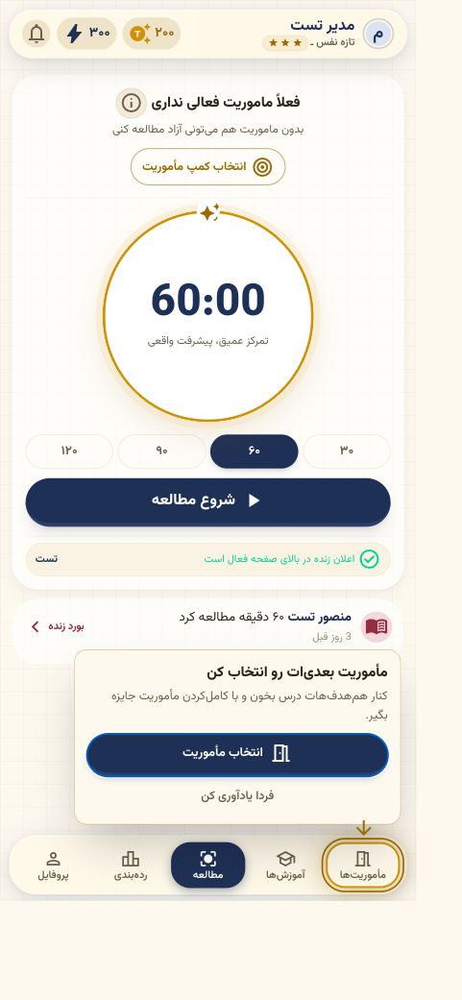
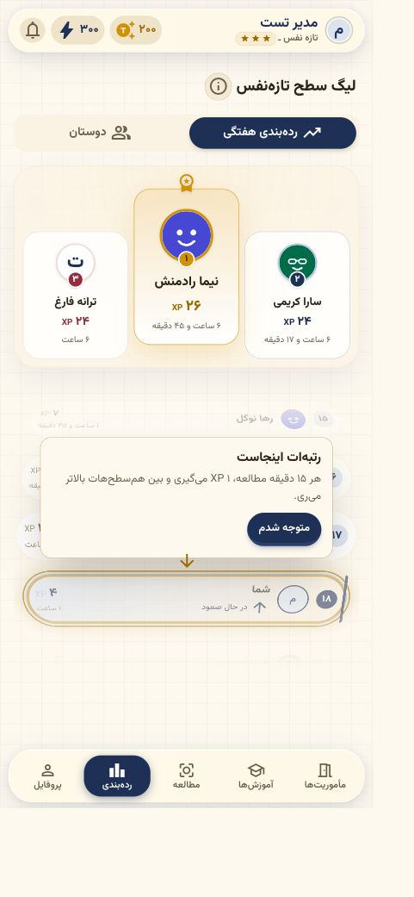
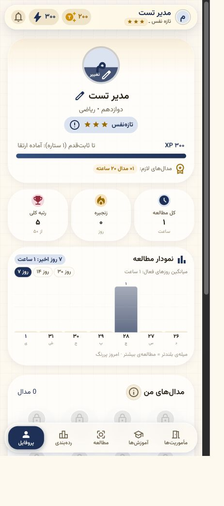
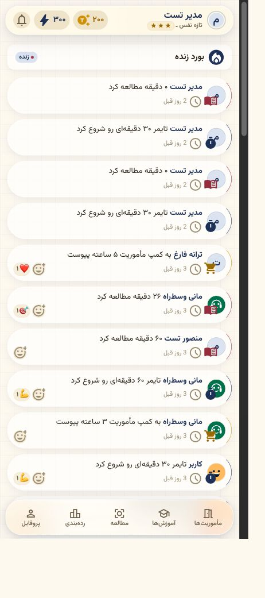
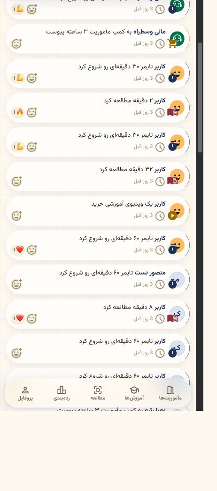

# ممیزی کندی و حس پاسخ‌گو نبودن G-camp

تاریخ: ۱۴۰۵/۰۶/۰۱ — 2026-08-23

## نتیجه اجرایی

مشکل واقعی است، اما در وضعیت فعلی منشأ اصلی آن CPU یا دیتابیس سرور نیست. اندازه‌گیری‌ها سه لایه را نشان می‌دهند:

1. مسیر شبکه، TLS و CDN آروان نوسان زیادی دارد و حتی برای صفحه عمومی ورود صدها میلی‌ثانیه تا چند ثانیه تأخیر ایجاد می‌کند.
2. بعد از لمس تب، بازخورد ماندگار و فوری وجود ندارد؛ بنابراین کاربر در فاصله دریافت RSC همچنان صفحه قبلی را می‌بیند و تصور می‌کند لمس ثبت نشده است.
3. معماری فعلی این تأخیر را تشدید می‌کند: همه مسیرهای اصلی پویا هستند، پنج تب به‌اجبار prefetch می‌شوند، layout مشترک چند خواندن دیتابیس دارد، بعضی renderها side effect دارند و تعداد زیادی `router.refresh()` کل درخت مسیر را دوباره اجرا می‌کند.

در نتیجه، اول باید مسیر CDN و بازخورد ناوبری اصلاح شوند؛ سپس کار سرور به shell فوری و بخش‌های streamشونده تقسیم شود. تعویض دیتابیس یا بزرگ‌کردن سرور در شرایط فعلی راه‌حل ریشه‌ای نیست.

## شواهد اندازه‌گیری‌شده

| لایه | نتیجه | برداشت |
|---|---:|---|
| مسیرهای احراز‌شده روی محیط محلی | عمدتاً ۵ تا ۲۳ms؛ اولین dashboard برابر ۸۸ms | RSC و دیتابیس فعلی سبک‌اند |
| Next روی خود سرور production برای `/login` | ۱۷ تا ۲۲ms | process اصلی سالم و سریع است |
| production از پشت CDN با اتصال نگه‌داشته‌شده | درخواست اول ۱.۴۷s، بعدی‌ها ۵۳۷ تا ۶۷۹ms | سربار ثابت شبکه/CDN محسوس است |
| اتصال‌های تازه به دامنه production | مجموع ۱.۷ تا ۷.۲s؛ بخش عمده در TLS | نوسان بحرانی در مسیر تحویل |
| `server-timing` آروان | حدود ۲۹۸ تا ۳۱۲ms | حتی پاسخ cache‌شده نیز سربار edge دارد |
| منابع سرور | load حدود ۰.۰۱، اپ حدود ۲۷۷MiB، DB فقط ۴ کاربر و ۱۲ session | کمبود CPU/RAM یا حجم داده علت فعلی نیست |

محدودیت: تست شبکه از یک نقطه و POP با `x-sid: 5700` انجام شده؛ برای تصمیم نهایی باید همین داده از چند اپراتور موبایل ایران و حالت PWA جمع شود.

## بررسی جریان‌ها

### ۱. تمرکز / داشبورد — سلامت بصری خوب، ریسک پاسخ‌گویی زیاد

تایمر به‌درستی مرکز بصری صفحه است و با وعده اصلی محصول هم‌راستا است. با این حال، راهنمای «ماموریت بعدیات رو انتخاب کن» روی محتوای پایین و navigation می‌افتد. از نظر فنی، داده تایمر همراه onboarding، ماموریت‌ها، فعالیت زنده و شمارش کاربران فعال منتظر می‌ماند. در نسخه درحال‌کار فعلی، `processUserMissions` نیز پیش از همه این خواندن‌ها به‌صورت blocking اجرا می‌شود؛ این پردازش شامل چند query، aggregate و transaction است و نباید در GET/render یا prefetch صفحه باشد.

### ۲. جدول برتر — ساختار قابل فهم، query مسیر رشدپذیر نیست

تب فعال و سکو خوانا هستند، اما spotlight روی لیست و navigation حس توقف ایجاد می‌کند. در سمت سرور، خواندن کاربر، ساخت referral code، شمارش تورنمنت، دریافت شناسه رقبا، دریافت کاربران و aggregate هفتگی عمدتاً زنجیره‌ای‌اند. نوشتن referral code هنگام render نیز باعث می‌شود prefetch یک عملیات تغییردهنده اجرا کند.

### ۳. پروفایل — اطلاعات کامل، first paint بیش از نیاز سنگین

هویت بصری یکپارچه است، ولی هدر، آمار، نمودار، مدال‌ها و تنظیمات در یک render بلند بار می‌شوند. بخش بالای صفحه باید مستقل و فوری باشد و نمودار/مدال/تنظیمات پشت Suspense یا lazy loading قرار بگیرند.

### ۴. بورد زنده — ریسک paint و scroll روی موبایل ضعیف

صفحه تا ۲۰۰ activity را نگه می‌دارد و هر ردیف از `backdrop-filter: blur(20px)` و shadow استفاده می‌کند. این الگو روی GPU موبایل‌های میان‌رده و ضعیف می‌تواند scroll را ناصاف کند. فهرست باید cursor pagination با ۲۰ تا ۳۰ مورد داشته باشد و کارت‌های تکرارشونده پس‌زمینه ساده‌تری بگیرند.

## علت‌های فنی به‌ترتیب اثر

### P0 — فوری

1. **نوسان TLS/CDN:** با آروان روی handshake، POP، HTTP/2/3، keep-alive به origin و cache شدن `/_next/static/*` بررسی شود. origin مستقیم و CDN از چند اپراتور A/B شوند؛ CDN بدون آزمایش حذف نشود.
2. **نبود feedback ناوبری:** تب لمس‌شده باید زیر ۱۰۰ms حالت pending ثابت، بدون تغییر ابعاد، نشان دهد. از `useLinkStatus`، `aria-busy` و متن مخفی «در حال بارگذاری» استفاده شود. active شدن تب نباید فقط منتظر `usePathname` بماند.
3. **assetهای ورود:** `gcamp-logo.svg` حدود ۶۴۷KB، `gcamp-title.svg` حدود ۷۰۷KB و `institute-logo.svg` حدود ۲۲۶KB هستند؛ این‌ها SVG واقعی نیستند و raster base64 را بسته‌بندی کرده‌اند. نسخه AVIF/WebP متناسب با اندازه نمایش ساخته و `unoptimized` حذف شود.
4. **migration ناقص indexها:** schema سه index ترکیبی StudySession را اعلام می‌کند، اما migration اعمال‌شده آن‌ها را ندارد. migration جداگانه برای `(userId,startTime)`، `(userId,endTime)` و `(endTime,pausedAt,startTime)` اضافه شود. این مورد علت کندی فعلی نیست، اما پیش از رشد ضروری است.

### P1 — یک تا سه روز

5. `processUserMissions`، `ensureReferralCode` و upsertهای onboarding از render/GET/prefetch خارج و به mutation یا job منتقل شوند.
6. هر مسیر یک shell فوری و loading اختصاصی داشته باشد. در Next 16.2.9، Cache Components و `unstable_instant` فقط همراه Suspense و پس از بررسی راهنمای محلی Next فعال شوند؛ timer/header ابتدا، pulse/report/medals بعداً stream شوند.
7. بررسی ماموریت، bot prompt و count جلسه از layout مشترک خارج و به داشبورد محدود شود. layout فعلی در هر ورود احراز‌شده session، user، count، mission و inbox را می‌خواند.
8. `prefetch={true}` برای هر پنج مسیر پویا حذف کورکورانه نشود؛ پس از ساخت shell فوری، به prefetch خودکار یا staged/idle برای مسیر محتمل تبدیل شود. وضعیت فعلی برای هر کاربر چند render شخصی و ده‌ها query را پیش از کلیک ایجاد می‌کند.
9. پس از خرید، پایان تایمر و ویرایش پروفایل، پاسخ API وضعیت authoritative را برگرداند و state محلی به‌روزرسانی شود؛ `router.refresh()` برای تغییرات ساختاری نادر بماند.

### P2 — این هفته و پیش از رشد

10. leaderboard در دیتابیس aggregate/filter شود و فقط top 50 + رتبه کاربر برگردد؛ در مقیاس بالاتر score هفتگی materialize شود.
11. feed با cursor pagination، `content-visibility:auto` و کارت بدون blur تکراری سبک شود.
12. PostHog پس از interactive/idle بار شود؛ Sentry error capture حفظ شود و bundle analyzer برای chunkهای بزرگ اجرا شود. JavaScript استاتیک حدود ۲.۱MB uncompressed است و instrumentation در shell عمومی بار می‌شود.
13. RUM بدون PII اضافه شود: زمان click-to-feedback، click-to-paint هر route، hit/miss prefetch، TTFB/RSC، INP، LCP، CLS، نوع شبکه، device class و standalone PWA. هدف: feedback کمتر از ۱۰۰ms، INP کمتر از ۲۰۰ms و محتوای تب گرم کمتر از ۳۰۰ms.
14. با ۵۰ و ۱۰۰ کاربر هم‌زمان load test اجرا و queue شدن pool ده‌تایی PostgreSQL، event-loop lag و p95/p99 RSC ثبت شود.

## نقاط قوت

- تایمر همچنان اکشن غالب و مرکز تجربه است.
- payload کامل RSC مسیرها در تست محلی حدود ۱۰ تا ۲۵KB بود و حجیم نیست.
- build production موفق بود و سرور/Redis/PostgreSQL در زمان بررسی سالم بودند.
- `aria-current` در navigation و `prefers-reduced-motion` در CSS وجود دارد.
- قواعد پاداش و ضدتقلب سمت سرور باقی می‌مانند و پیشنهادها نیازی به تضعیف آن‌ها ندارند.

## ریسک‌های دسترس‌پذیری

- pending شدن route نه بصریِ ماندگار دارد و نه برای screen reader اعلام می‌شود.
- skeleton مشترک `aria-busy`/status ندارد.
- overlayهای آموزشی بخشی از محتوا و navigation را می‌پوشانند؛ باید focus trap، دکمه ردکردن واضح و عدم انسداد اکشن اصلی بررسی شود.
- عملکرد واقعی scroll و INP روی موبایل ضعیف از screenshot قابل اثبات نیست و نیاز به RUM/تست دستگاه دارد.

## ترتیب اجرای پیشنهادی

1. instrumentation کوتاه‌مدت + A/B شبکه/CDN؛ تا عدد پایه نداشته باشیم اصلاحات قابل اثبات نیستند.
2. feedback فوری تب و loading اختصاصی؛ سریع‌ترین بهبود ادراکی.
3. خارج‌کردن side effectها و پردازش ماموریت از render.
4. shell فوری و streaming برای dashboard/profile/leaderboard.
5. asset، feed، query و indexهای مقیاس‌پذیری.

نکته وضعیت مخزن: هنگام ممیزی، پنج فایل مربوط به ماموریت/پایان جلسه به‌صورت uncommitted تغییر کرده بودند. این گزارش آن‌ها را دست‌کاری نکرده است. build و benchmark اولیه پیش از این تغییرات انجام شد؛ افزودن blocking `processUserMissions` در dashboard فعلی باید پیش از deploy بازنگری شود.
